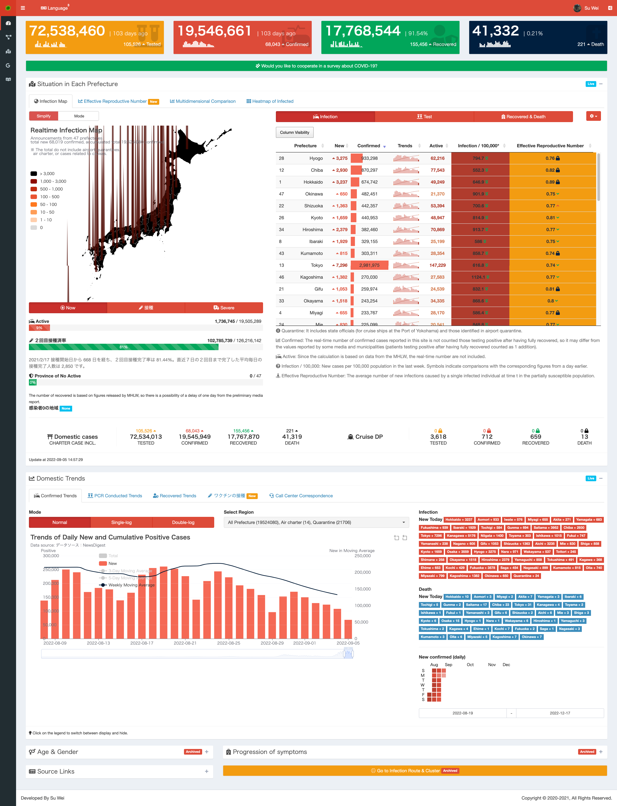

# COVID-19 BULLETIN BOARD

[`🇯🇵日本語`](https://github.com/swsoyee/2019-ncov-japan/blob/master/README.md) | [`🇨🇳中文`](https://github.com/swsoyee/2019-ncov-japan/blob/master/README.cn.md) | `🇺🇸English`

The project is a website for real-time visualization of the COVID-19 epidemic in Japan, developed mainly using the `R` language with `shiny` and other open-source packages. It mainly shows various indicators including, but not limited to, PCR test, positive confirmed, hospital discharge and death, as well as trends in each prefecture in Japan, and there are also a variety of charts such as cluster network, new confirmed case in log scale for users' reference.

## Online Access Links

Online access site has been shutdown due to the policy changing of Covid-19 case number monitoring of Japan government.

## Snapshot

## About the data

The data used on this site are all public data sets, mainly divided into the following three categories:

1. Real-time data are collected based on the news media: the number of confirmed diagnoses and deaths are from [News Digest](https://newsdigest.jp/pages/coronavirus/) and the values are consistent with the above-mentioned website.
2. Aggregated data announced by the [Ministry of Health, Labour and Welfare](https://www.mhlw.go.jp/stf/seisakunitsuite/bunya/0000121431_00086.html), such as number of PCR tests conducted, hospital discharges, calls to the novel coronavirus call center, etc.
3. Company ([SIGNATE COVID-19 Dataset](https://drive.google.com/drive/folders/1EcVW5JQKMB6zoyfHm8_zLVj---t_hccF)), dataset collected by other volunteers ([@kenmo_economics](https://twitter.com/kenmo_economics)）and data from open source projects derived from the [Tokyo COVID-19 Information](https://github.com/tokyo-metropolitan-gov/covid19/blob/development/FORKED_SITES.md) (those dataset are updated by the official or the maintainers based on information from the municipality), etc.

Due to the complexity of the data, differences in aggregation time periods or standard issues, there are more or less minor differences in values. Statistical standards vary from media to media, so it is normal for values to vary from site to site. Therefore, all charts and values on this site are for reference only. Please be aware that this website and its management team are not responsible for any problems arising from the secondary use of the contents and materials published on this website.

## Message from the Team

Since COVID-19 was reported to the World Health Organization in December of 2019, the pandemic has spread globally, causing an unprecedented social, behavioral, and economic impact across the world. In Japan, the first COVID-19 case was identified on 15 Jan 2020 and subsequently the disease has since transmitted across different prefectures to the entire country.  
In response to this public health emergency, this COVID-19 dashboard has been made available to the Japanese population since 1 February 2020.  Featuring multi-dimensional data visualization tools, this platform allows the general public to easily understand the evolution of the pandemic. As of 1 year of this site’s operation, it has already attracted more than 20 million visits (98% of them were initiated from Japan locally).  
We believe that being able to efficiently inform the public about COVID-19 case situation allows the public to be vigilant, and that plays an essential role in containing and controlling the pandemic (WHO prevention guide). As efforts toward mass vaccination unfold, there are hopeful signs of an improvement in the situation. In the meantime, our site will continue to serve as essential disease communication tool and information hub until the pandemic ends.

## Member

### Project Creators

- Data collection, Visualization development: [@swsoyee](https://github.com/swsoyee)  
- Server setting, O & M: [@Bob-Fu](https://github.com/Bob-FU)  
- Academic Advisor: Dr Zoie SY Wong, [Twitter: @zoiesywong](https://twitter.com/zoiesywong) / [Github: @zoiewong](https://github.com/zoiewong)

### Contributors

- R-related technical support: [@uribo](https://github.com/uribo)  
- Data automation updates: [@emckk](https://github.com/emc-kk)  
- Japanese Localization: [@kilisame4](https://github.com/kilisame4)  

All interested parties are welcome to join this open source project!

### [Citation](./CITATION.cff)

Su, W., Fu, W., Kato, K., & Wong, Z. S. (2021). “Japan LIVE Dashboard” for COVID-19: A Scalable Solution to Monitor Real-Time and Regional-Level Epidemic Case Data. Studies in Health Technology and Informatics, 286(1), 21–25. https://doi.org/10.3233/SHTI210629
