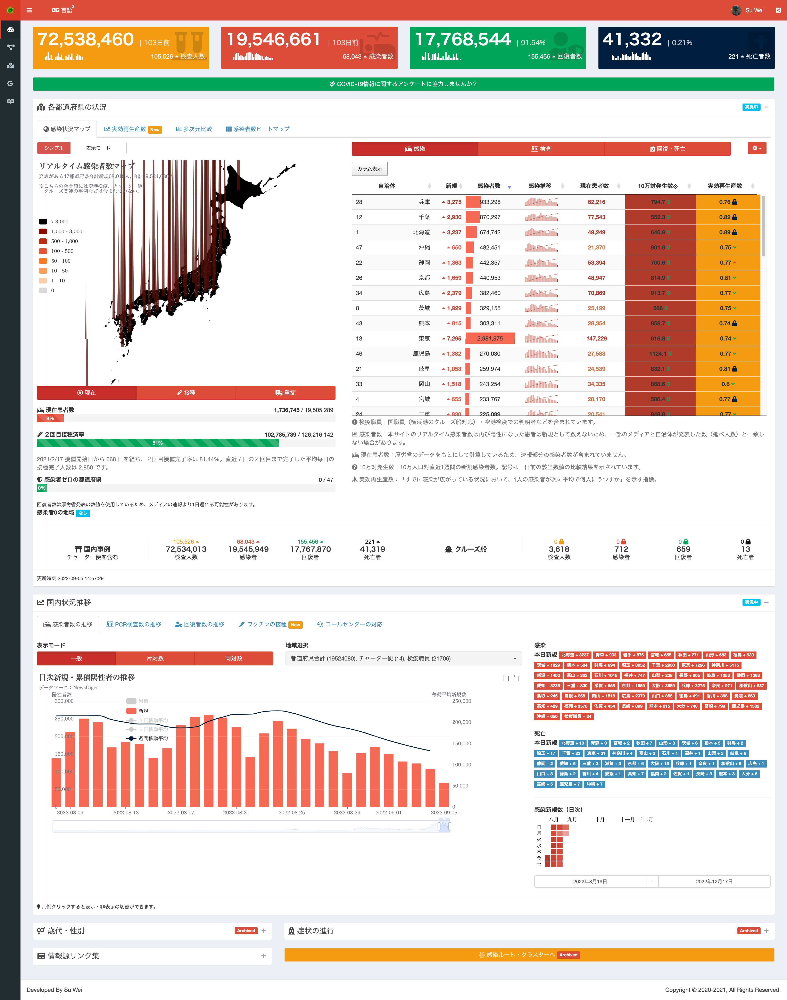

# 新型コロナウイルス感染速報

`🇯🇵日本語` | [`🇨🇳中文`](https://github.com/swsoyee/2019-ncov-japan/blob/master/README.cn.md) | [`🇺🇸English`](https://github.com/swsoyee/2019-ncov-japan/blob/master/README.en.md)

このプロジェクトは、`R言語`で`shiny`および他のオープンソースパッケージを用いて、日本のCOVID-19発生状況をリアルタイムで可視化しているサイトです。主に検査人数・感染数・退院数・死亡数などの各種指標およびその傾向を、全国または都道府県別で示しており、クラスターネットワーク、対数グラフなど多数のグラフが用意されています。

## オンラインアクセスリンク

新型コロナ“感染者の全数把握簡略化”開始によって、正確な感染者数を把握するのが難しくなるため、令和4年12月17日をもってオンラインサイトを閉鎖しました。

## スクリーンショット

### サイトのデータについて

当サイトで使用しているデータは全て公開されているデータで、主に以下の3つに分類されます。

1. ニュースメディアによるリアルタイムデータ：感染者数・死亡者数の速報値は[JX通信社](https://newsdigest.jp/pages/coronavirus/)と一致しています；
2. PCR検査人数、退院者数、コールセンターの受付回数などのデータは[厚生労働省](https://www.mhlw.go.jp/stf/seisakunitsuite/bunya/0000121431_00086.html)が毎日更新しているページからデータを取得しています；
3. 企業（[SIGNATE COVID-19 Dataset](https://drive.google.com/drive/folders/1EcVW5JQKMB6zoyfHm8_zLVj---t_hccF)）、個人が整理しているデータセット（[@kenmo_economics](https://twitter.com/kenmo_economics)）、または[東京都新型コロナウイルス対策サイト](https://github.com/tokyo-metropolitan-gov/covid19/blob/development/FORKED_SITES.md)から派生した自治体または個人がメンテナンスしているサイトから自治体のデータを取得し、本サイトで異なる可視化手法でデータを再利用しています。

各種データセットの集計時間や、集計標準などが異なるため、数値周りに多少のズレが発生する可能性があります。各メディアの集計方法も異なるため、サイト間にデータの不一致が生じることも珍しくありません。従って、掲載された情報の内容の正確性については一切保証しません。また、当サイトに掲載された情報・資料を利用、使用、ダウンロードするなどの行為に関連して生じたあらゆる損害等についても、理由の如何に関わらず、本サイトおよび運営メンバーは一切責任を負いません。予めご了承ください。

## Message from the Team

Since COVID-19 was reported to the World Health Organization in December of 2019, the pandemic has spread globally, causing an unprecedented social, behavioral, and economic impact across the world. In Japan, the first COVID-19 case was identified on 15 Jan 2020 and subsequently the disease has since transmitted across different prefectures to the entire country.  
In response to this public health emergency, this COVID-19 dashboard has been made available to the Japanese population since 1 February 2020.  Featuring multi-dimensional data visualization tools, this platform allows the general public to easily understand the evolution of the pandemic. As of 1 year of this site’s operation, it has already attracted more than 20 million visits (98% of them were initiated from Japan locally).  
We believe that being able to efficiently inform the public about COVID-19 case situation allows the public to be vigilant, and that plays an essential role in containing and controlling the pandemic (WHO prevention guide). As efforts toward mass vaccination unfold, there are hopeful signs of an improvement in the situation. In the meantime, our site will continue to serve as essential disease communication tool and information hub until the pandemic ends.

## 開発メンバー

### 主催者

- データ収集、`shiny` を利用した可視化開発：[@swsoyee](https://github.com/swsoyee)  
- インフラ、サーバーのメンテナンス：[@Bob-Fu](https://github.com/Bob-FU)  
- 学術指導：ウォンスイー准教授、[Twitter: @zoiesywong](https://twitter.com/zoiesywong) / [Github: @zoiewong](https://github.com/zoiewong)

### 貢献者

- Rの技術サポート：[@uribo](https://github.com/uribo)  
- データの自動化更新：[@emckk](https://github.com/emc-kk)  
- 日本語ローカライゼーション：[@kilisame4](https://github.com/kilisame4)  

協力できる有志がいれば、お気軽にご連絡ください。Rのことがわからなくても貢献できることは必ずありますmm。  
> 例えば日本語の文言の修正、データセットの収集など。

### [引用](./CITATION.cff)

Su, W., Fu, W., Kato, K., & Wong, Z. S. (2021). “Japan LIVE Dashboard” for COVID-19: A Scalable Solution to Monitor Real-Time and Regional-Level Epidemic Case Data. Studies in Health Technology and Informatics, 286(1), 21–25. https://doi.org/10.3233/SHTI210629
