# 用shiny和echarts4r制作一个COVID-19的dashboard

本文主要分享一下我从1月底开始的一个用`shiny`制作的用来关注日本疫情动态的项目。项目本身为日文版`(https://covid-2019.live/)`，然后上个月开始逐步翻译成中`(/cn)`英文`(/en)`版本。项目所有代码和数据集全部开源[swsoyee/2019-ncov-japan](https://github.com/swsoyee/2019-ncov-japan)。只要Clone到本地，安装完所有需要的软件包即可本地启动。

需要注意的是由于项目开发是本人利用工作之余时间赶制而成，我本人也不是R语言老手和shiny应用开发老手，代码质量和项目结构可能极其恐怖（能用就行），各位吐槽时希望能嘴下留情。如果大家能帮忙提出改进的PR当然是最好的了！

另外文笔不好请大家多多包涵。文章对废话进行了标注，各位跳着看即可。

这个dashboard经过了数次迭代（GitHub的commit数量高达4000多次，去掉近一半的数据更新的类的commit外几乎都是功能改善的结果），到现在它长成了下面这个样子：
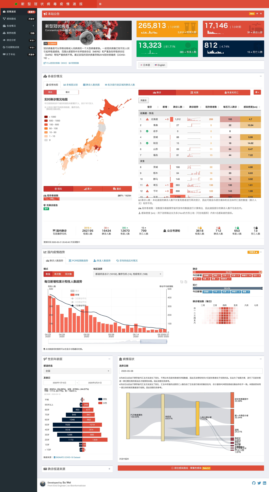
而在最开始的时候，它还是下面这个样子的：
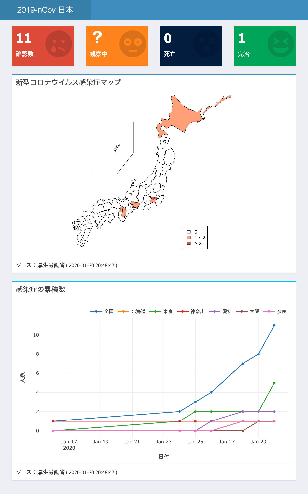

现在这个dashboard在不进行任何推广下，浏览数从2月中旬刚上线的时候日均3000到现在稳定每日在10万，取得了总浏览量超过600万的成绩。

下面就让我来详细说明一下这个dashboard的制作和相关技术，如果能够帮各位读者在如何用shiny打造一个像模像样的dashboard路上减少一些弯路就最好不过了。

## 项目规划

我在开发这个项目时，首先对项目做了一些定位思考。

归结起来为以下几点：

1. 做一个能够实时快速反映各地数据的dashboard；
2. 在尽可能多维度展示数据上下功夫；
3. 注重动态互动，处理好疫情时间轴。

下面主要是一些详细的个人思考流程，废话比较多不感兴趣的各位可以直接跳过。

> - 1月底的时候，国内已经进入到了确诊人数快速增加的阶段，而那时日本才刚刚开始（在开始着手开发时，日本全国的确诊人数还在个位数）。作为我自己来说，在国内的疫情刚开始的时候，自己包括周围的朋友都十分关注哪个省份出现了疫情，具体确诊人数在多少（也就是丁香园的页面刚刚上线的时候）。因此在疫情初期，就很需要一个能够实时快速展现各地区数据的页面了，而在那时日本还没有出现此类应用。
> - 如果仅仅是提供单纯的数据，则会显得内容十分地薄弱。而日本的互联网大厂届时肯定会竞相开发自己的疫情信息页面（就如在丁香园之后，BAT等各个大厂都开发了自己产品线上的页面）。此时，一般用户肯定更倾向于使用有企业或者官方作为准确性担保的页面，而不去在意一个个人项目，最终只会导致沦落到被打开一次就不再次点击的个人小作品。因此页面需要更多能够清晰帮助人们在各方面了解到疫情的综合类应用。而如果定位在信息收集类或者内容提供类的网站上的话，毕竟个人精力有限，百分百会被互联网大厂给挤兑掉。因此如果能在数据展示方面下一些功夫，提供一些稍有学术性质但普通用户又不难理解的内容的话，或许能有自己的一席之地。此时就能体现出dashboard类应用的优势了。
> 在疫情结束之后，对于一般人来说，也就几乎不会再次访问了。而如果是一个能够动态展示过去数据的疫情网站的话，这或许还能够发挥预热，对未来的学术性研究起到一定的协助作用。因此一定要处理好时间轴这一项，使得项目能够苟延残喘更长远一些。

## 数据源

为了满足我项目的需求，那么就需要开始选择我们dashboard最为重要部分——数据源了。

1. 以媒体发布的新闻或数值作为主要实时数据源（半自动）；

2. 各级政府和厚生劳动省的数据在其官方上公开的（手动）；

3. 其他志愿者汇总整理的数据集（自动）。

同样，话唠本质提醒您以下废话可以选择跳过。

> - 首先，霍普金斯大学的数据中没有细致到日本各个省份的数据，因此只能自己手动收集数据（1月末的时候）。日本官方发布疫情数据的机构为各个自治体（省份）和相当于国内卫生部的厚生劳动省。而在自治体和厚劳省所发布的数据并不即时，只有各个媒体的所报的消息最快。因此只能自己关注各大媒体的消息，自己打造实时数据集。而在2月初时发现一家媒体[JX通讯社](https://newsdigest.jp/pages/coronavirus/)上线了自家的疫情页面，数据更新速度在所有日媒中是最快的，因此在后期我也就参照他家的数据进行实时数据部分的更新了。
> - 此外，在对项目的定位上，需要应用提供足够多维度的数据可视化信息，因此很多没办法实时获取到的数据如检测人数、出院数，新冠咨询热线拨打次数等，都仅在各级政府和厚劳省的页面进行汇总，因此同时我们也需要收集这部分数据用于可视化。
> - 对于一些数字外的信息，如患者的个人活动轨迹、症状等等详细的患者信息都只能在各级政府的网站上获取到，还是没有统一格式的PDF文档。但好在还是有日本企业SIGNATE（日本版Kaggle）和一些网上的志愿者在进行数据整理，因此我们也可以利用这一部分数据来进行更丰富的可视化。

## 主要框架

当然逃不过最为基础的`shiny`，dashboard框架为`shinydashboardPlus`(还有一些升级版如`bs4Dash`等，当我注意到的时候已经晚了，重构自己的网站开销太大)。如果对shiny开发应用的话可以关注[`RinteRface`](https://github.com/RinteRface)这个组织，他们提供了很多有意思的包使得你的应用更为酷炫。另外Github上的[`awesome-shiny-extensions`](https://github.com/nanxstats/awesome-shiny-extensions)库也罗列了很多有意思的`shiny`插件包，十分推荐感兴趣的各位前去浏览浏览。

主要绘图包选用注重互动性的`echarts4r`（个人认为`ggplot2`更倾向于学术，而`plotly`的流畅度有点挫），表格展示为常用的`DT`，增强交互元件功能的`shinyWidgets`，悬浮提示的`shinyBS`，加载动画显示用的`shinycssloaders`，应用的多语言化的`shiny.i18n`，小图展示的`sparkline`等各类包。数据处理方面统一采用`data.table`。`shiny`应用的性能优化方面使用`profvis`。具体用法不一一介绍，大家只要根据名字去搜即可。

## 应用逻辑

可能对于一些老手来说下面的这些可能是初级问题，但由于非应用开发专业的前生信专业的渣渣的我来说也走过这个坑，作为经验还是想分享给大家，应用开发老手可以直接跳过。简单来说：

1. 展示类应用中应尽力避免在应用中进行数据处理的各项操作，将数据处理放到本地进行分离，`shiny`只直接读取处理后的数据即可。

2. 尽量避免在用户打开你的应用首页时读取全部数据，而为非首页所需要的数据读取做一个触发器（如点击标签切换时）。

～废话跳过提示～

> 第二点不怎么需要说明，主要提一下我在第一点踩过的坑。
> 由于搜集的数据结构往往不能够满足可视化时候所需要的结构，因此我们常常需要对`data.frame`或`data.table`进行一些处理，如添加内容，修改或者统计数据。起初我所有的数据变换都是在应用中完成的，这导致网站用户量只要稍微大一点点，服务器就直接繁忙到所有人都访问不了了。后来我发现其实可以写独立的数据处理脚本将原始数据处理成展示所需要的结构，然后直接读取展示用的表格就行了。而这个独立的脚本可以使用`git pre-commit hook`在你每次commit的时候进行脚本调用，或者是使用`Github Action`来完成数据的预处理。经过这次优化后网站的`403`次数明显下降了，美滋滋。
> 另外，还可以利用代码效率检查包`profvis`来判断一下采用那种方式能使得你的用户体验更为友好。

## 主要功能

废话了这么多，终于到了主要的dashboard功能介绍了。由于代码量较多，接下来就采用流水账方式走一遍吧。

### 1. 首页

主要以横向布局为主，分为4层结构。

#### 1.1 总计数值栏面板

和大多数dashboard一样，最重要的四项总数指标放在首位。左边的结构使用了`shinydashboardPlus`中的`widgetUserBox`，而右边的`valueBox`在原版的基础上搭配`tagList`和各种`tags$XX`进行内容扩展，使其能够融入更多的信息量。

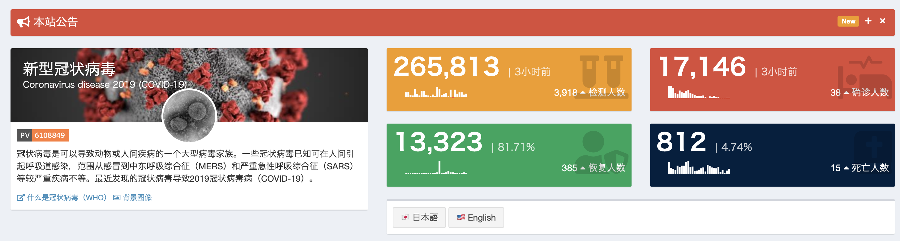

#### 1.2 全国数据总览面板

##### 1.2.1 疫情地图

这部分主要由4个标签构成，其中第一个标签的`疫情地图`由左侧地图右侧表格的结构构成，为整个应用中最为重要的部分。

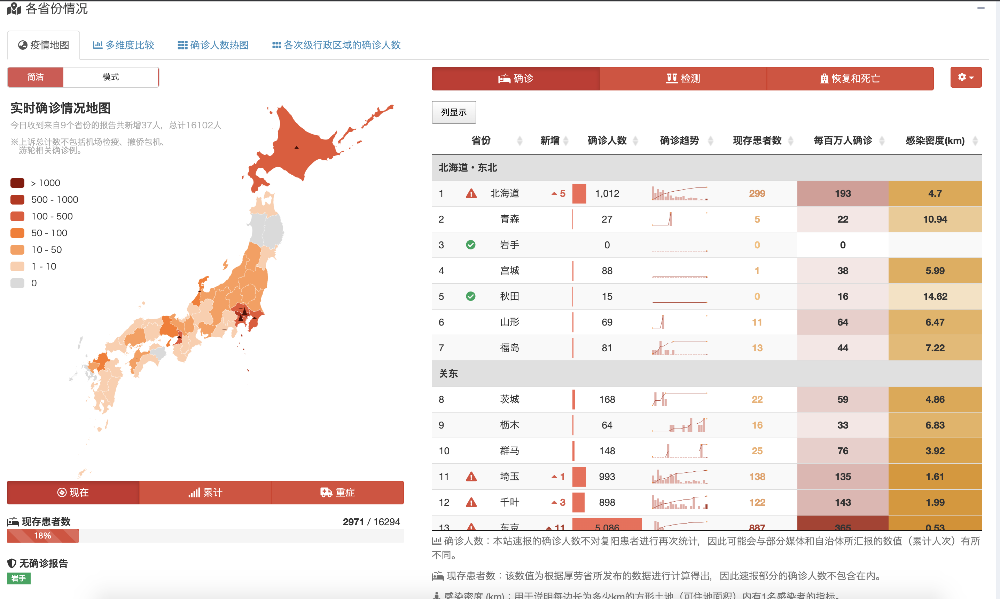

左侧地图分别有简易和详细两种模式。简易模式为静态地图，详细模式则是可以根据时间播放的动态地图（本身只提供动态地图，但出于优化用户体验的角度和减轻服务器的压力目的的考虑，增加了简易模式为默认选项）。简易模式目前分别有`现在患者数`、`累计患者数`和`重症患者数`3个选项供用户自行查看想获取的信息。地图下方有现存患者数的进度条，给用户了解现在疫情情况的一个更为直观的感受（如还差多少就能够清零了）。

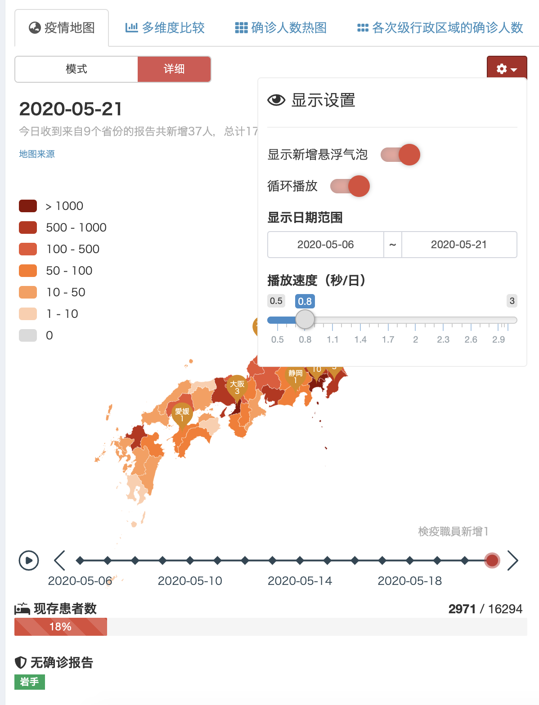

在动态疫情图中将可以看到从第一例开始的确诊累计的和每日各个自治体的增加情况，详情可以前往网站进行玩玩。此外还有一些简单的播放设定供用户自行调节。今后将会添加现存患者的动态地图，来展现一个从无到有从有到无的疫情发展过程。

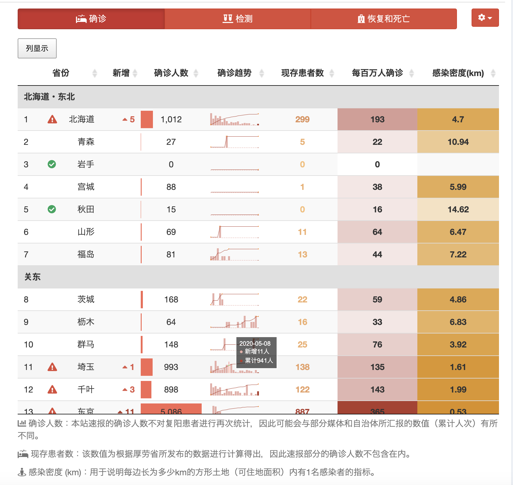

右边主要由于`确诊`、`检测`和`康复和死亡`三个表格构成，对于一些因为表格宽度不够的列或者是指标不太重要的列可以利用`DT`的自带插件功能做一个显示隐藏按钮（如图左上的`列显示`）。为了增加表格内容的丰富程度，可以利用`sparkline`包添加一些小的图表（如`确诊趋势`）在内。最初这个表格是在`shiny`内部生成的，但是就如上述逻辑部分中提到的一样，其生成开销较大，很容易造成多用户访问时软件崩溃或者是从打开页面到渲染完成所需时间非常长。所以推荐将此类处理和shiny应用本身进行分离。

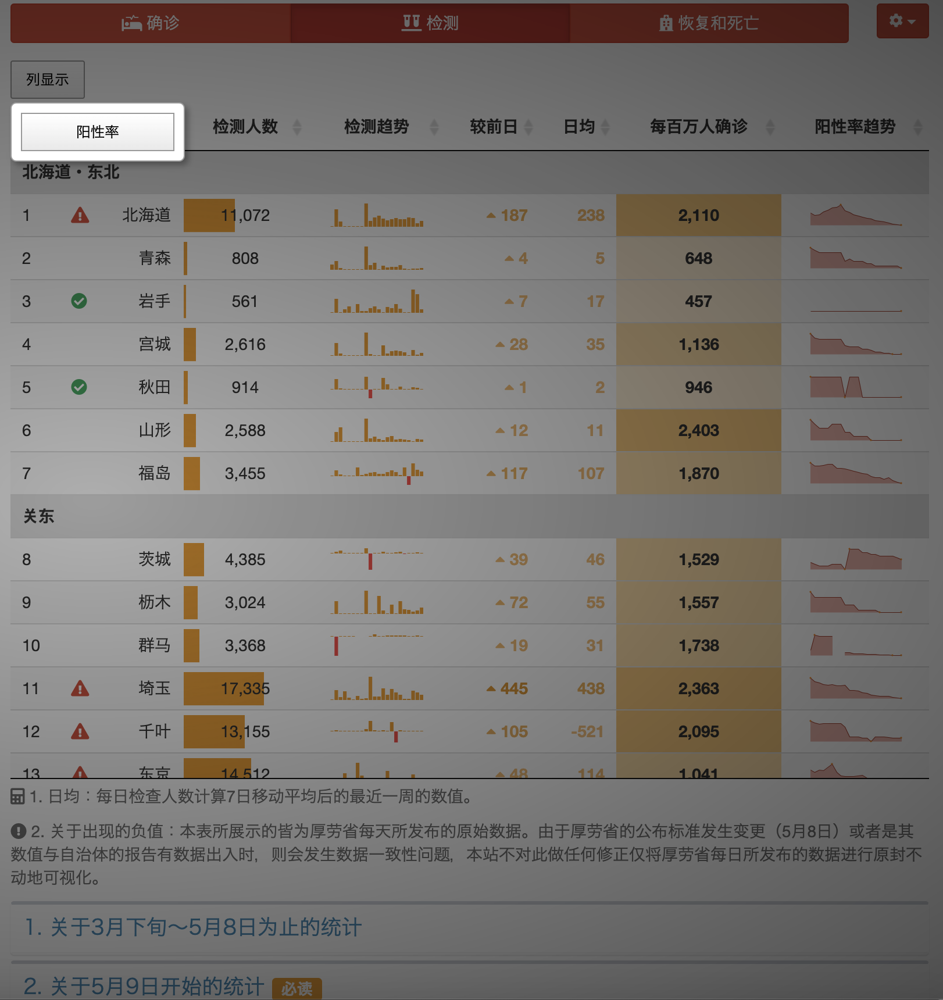

在`检测`表格中选择追加显示列。

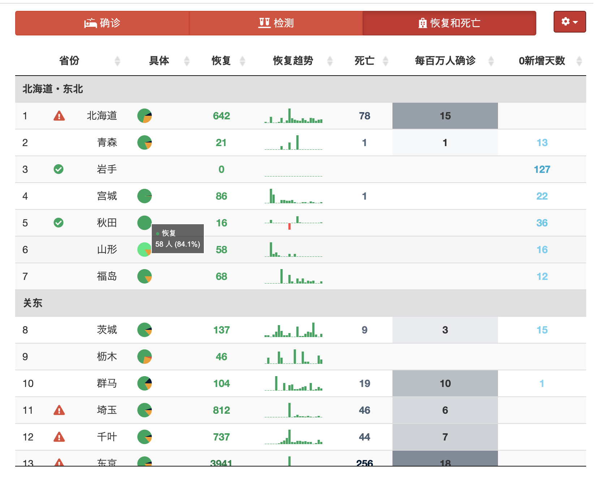

康复死亡表格完成度较低，不过同样可以利用`sparkline`作出扇形图用以展现康复百分比等信息。此外右上角还有各种设定可供用户自行调整显示方式等。

##### 1.2.2 多维度比较

此部分主要用来展示通过实时新闻报道收集的数值与厚劳省发布的数据的比较，目的在于清晰地让用户了解到本网站数据集的可信度。

在这个页面中同时用简单的条形图展示`检测人数`、`确诊`、`康复`、`重症`和`死亡`等各项数值的随时间变化情况。雷达图用来反映每个省份在这一个月内的各项指标变化情况。该功能处于初期版，今后预计加入时间选项和选取更为科学的指标来反映省份的疫情情况。此外，鼠标悬浮的提示框在使用`echarts4r`时候能够非常简单地将其联动起来，而如果用`ggplot2`或者`plotly`时候则可能要费一番功夫了。

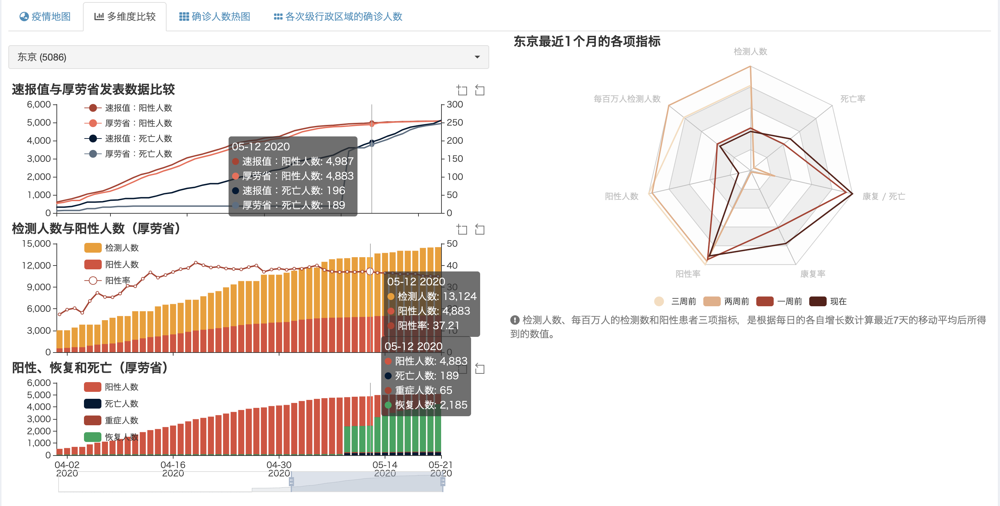

##### 1.2.3 确诊热图

目前提供了2张热图，虽然完成度还很低，但能够让用户非常直观地掌握到全国各地区的每日增长和增速情况。此外还可以考虑制作成3d形式的热图或者添加更多信息到这图表中（如各地区政府的疫情应对政策和大事件等）。配合右边的依然存在的空位和鼠标点击、悬浮操作可以制作出具有信息量的页面。

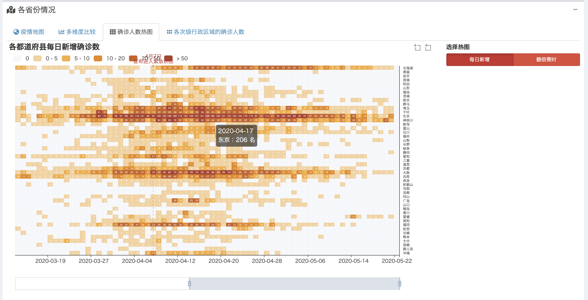
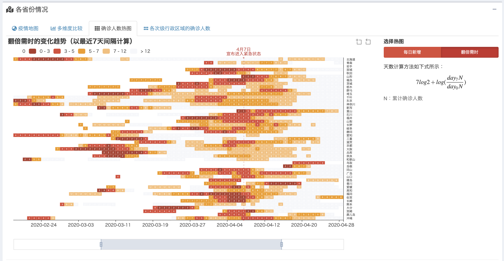

##### 1.2.4 确诊矩形树图

在很多疫情dashboard中，通常采用地图的形式展示每个地区的确诊人数情况（可用`leaflet`实现），但每个国家的所发表的确诊患者的详细程度不同，比如国内包括香港的dashboard可以实现精确到小区和楼栋，而日本通常最细只能获取到区级范围的信息，如果使用地图来展现的化，坐标定位就会是一个很大的问题，因此在这里我使用了矩形树图来进行可视化。

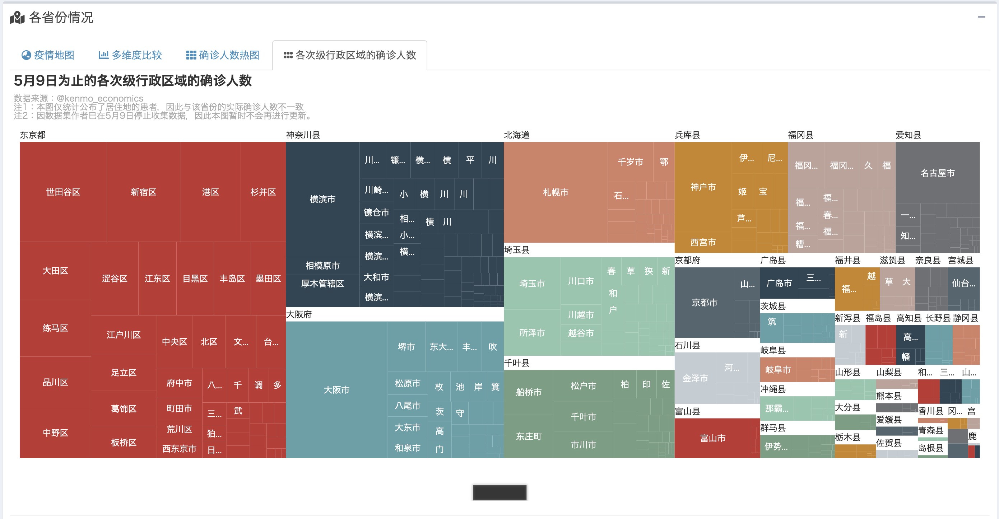

点击每一个矩形整个图形即可平滑地动态扩大、缩小和移动，展现次级数据。

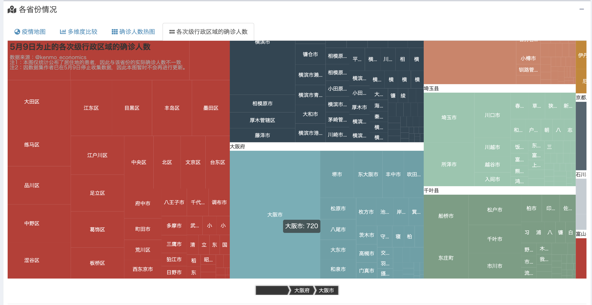

矩形树图在`echarts4r`中的完成度还很低，还有很多原版Echart中提供的设置选项无法使用。不过还是要感谢`echarts4r`的作者`John Coene`将百度团队的Echart引入到了R中，使得制作精美且交互性出色的图表不再困难，也期待百度和John带给我们更多新的绘图功能（有感而发非广告）。顺带吐槽一下John还会中文，强无敌。

##### 1.2.5 详细数值栏

在全国数据总览的`box`中的底部，使用`shinydashboardPlus`的`DescriptionBlock`制作了一排用于展示主要数据的底栏。一开始出于全面展示日本境内的疫情状况（包括医疗资源应对等）的目的，同时将公主号游轮的数据纳入了统计范围当中了（根据WHO的标准，公主号游轮单独进行了统计而不并作日本的数据）。因此在这里为了说明这一情况，把日本国内的计数和游轮进行分开统计以免造成误解。此外使用`shinyBS`中的`bsTooltip`进行一些额外信息的加注。

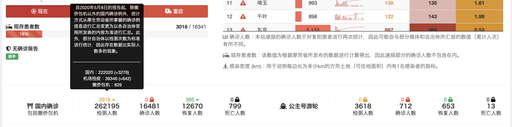

#### 1.3 各项数据的走势面板

这一部分主要是使用较为常见的柱状图、线形图等来描述疫情的发展趋势。大致以2:1结构进行面板划分，左侧为主要的柱状图，右侧为额外附加信息内容。

##### 1.3.1 确诊趋势

左侧为最基础的每日确诊图柱状图，右侧为各省份的每日增长情况。为了和上一个面板有所功能上的区分，在这里追加了可以对地区进行叠加显示的`地区选择`选项，方便用户自行选择某一地区的数据变化情况（如关西地区、关东地区等）。此外由于检测机构在周末和休息日时检测数量会明显下降，为了处理这种周期性带来的震荡，不仅在柱状图上添加了7日移动平均线，还在右侧添加了日历图来消除休息日对确诊数变化带来的视觉上的影响，方便大众自行对数据进行解读。

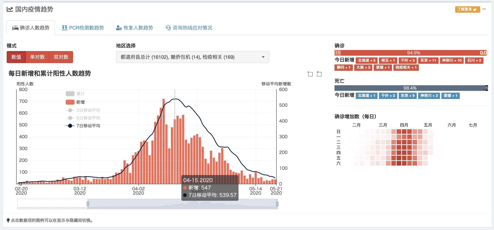

出于项目的定位考虑，引入了带有一点学术性质的单双轴对数确诊图。一般的大企业所开发的疫情页面可能出于更为简单明了地将数据呈现给尽可能多的一般用户的考虑，基本不会在页面中追加此类图表。而一般较为学术的用户来说，会参考对数图来对疫情走势进行一些判断。因此实时更新的对数图就能作为页面的一个亮点内容，避免了用户打开一次就不在访问的`一击脱离`的现象发生，从而维持一定的用户活跃度。

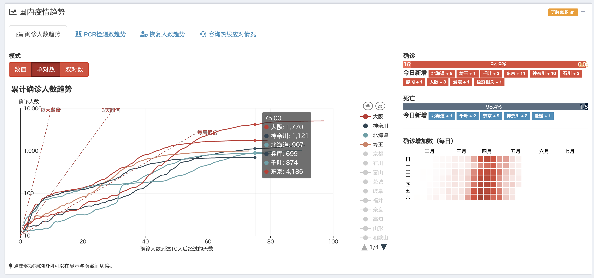

一些简单的设定如选择显示或隐藏某个自治体的数据，选择是否使用对数方式展现数据，或计算间隔等能够给用户提供一些显示定制。

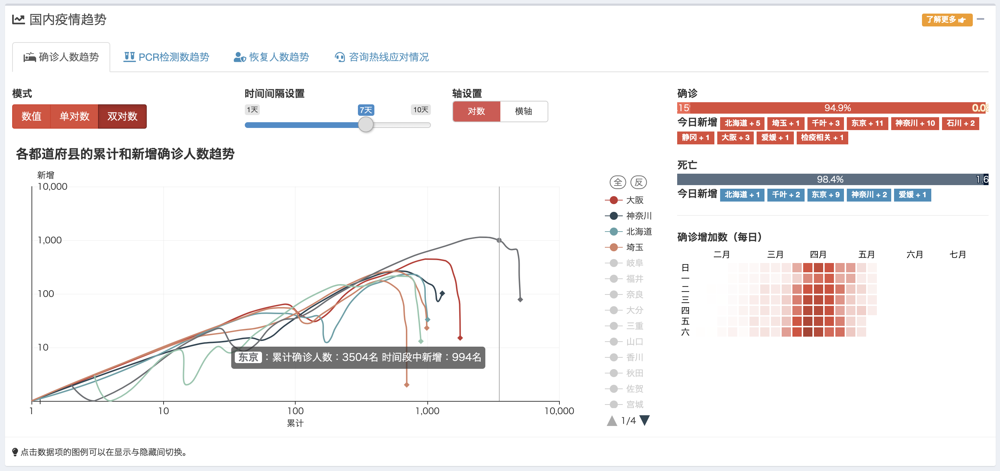

接下来是PCR检测人数、康复和新冠咨询热线的接线情况等。在`echarts4r`下支持图例点击（显示/隐藏）效果，而在切换的过程中会有**默认过渡动画**效果，个人认为这一点比`plotly`更为出色。

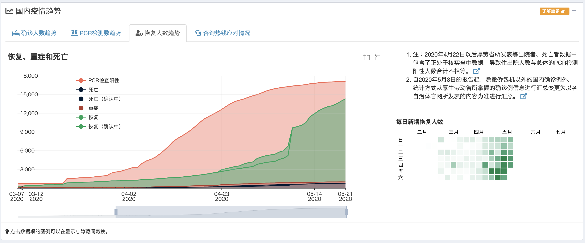
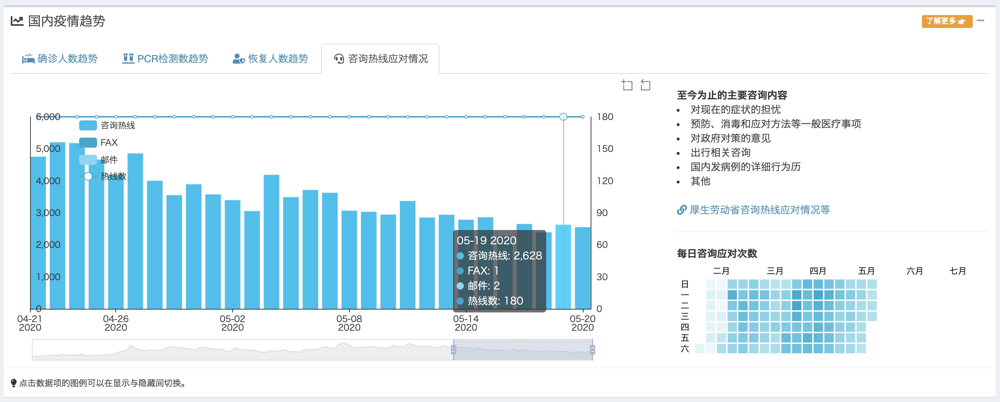

#### 1.4 其他数据

这部分目前主要有确诊患者的性别年龄金字塔图，用户可自行选择想查看的都道府县情况，或者是搭配确诊日期来进行所展示的数据的调节。

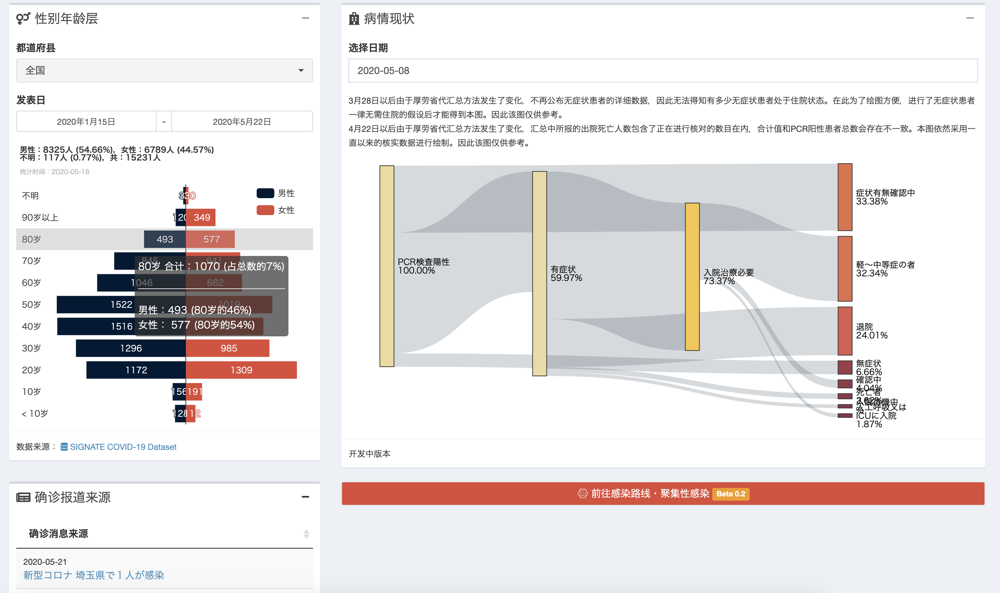

右侧为一个关于确诊患者去向的Sankey图。用于显示每日确诊患者的流向（症状的有无轻重、是否在住院、出院和死亡等信息）。但由于厚生劳动省所发表的数据格式有过多次变更，而上述信息已经不再进行详细公布，因此这个Sankey图可以说已经可有可无了。待以后有时间再进行修正。

下方左侧则是每一个确诊患者的新闻来源，提供给用户用于参考，同时为网站所收集数据提供一个可靠性说明。右侧为一个跳转到聚集性感染网络图（后述）的按钮。至于为何要在这里加一个按钮，是出于移动端页面的考虑。在移动端中，如果启用了侧边栏，`shinydashboard`默认会将侧边栏进行隐藏，一般用户很少发现页面还能提供额外的功能。而聚集性感染网络图是本站较为重要的一个亮点，为了让新用户能够了解到这一点，因此在这里添加了一个跳转到别的子页面的按钮就显得有所必要了。

### 2. 其他功能页面

剩下的一些页面由于完成度都不太高，就简要带过了。

在`感染路线`子页面中，可以看到确诊的病例是如何传染开来构成一张整体的网络的。鼠标悬浮于节点可以高亮显示患者简要信息，点击则会在右侧面板中显示患者完整信息。此外还可以通过右侧的搜索框对患者进行搜索。不过目前由于通过第三方收集的数据集的结构常常发生变化，4月5日以后的数据暂时还无法更新。只能等待数据集稳定后再对此功能进行重构了。
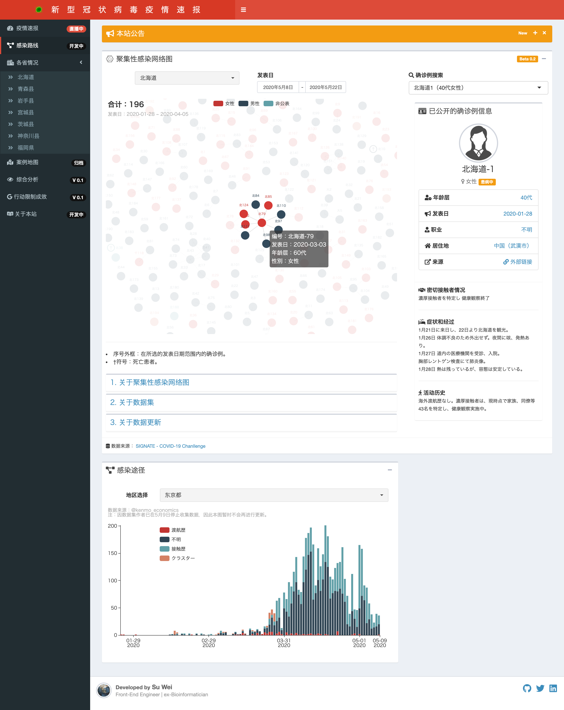

接下来是各省份的单独页面。和首页使用厚劳省的数据不同，这里是直接使用各自治体所发布的数据进行可视化。但目前由于完成所有47个都道府县的独立页面的工程量实在太大，目前只能暂时放弃了。欢迎有感兴趣的伙伴提交PR。

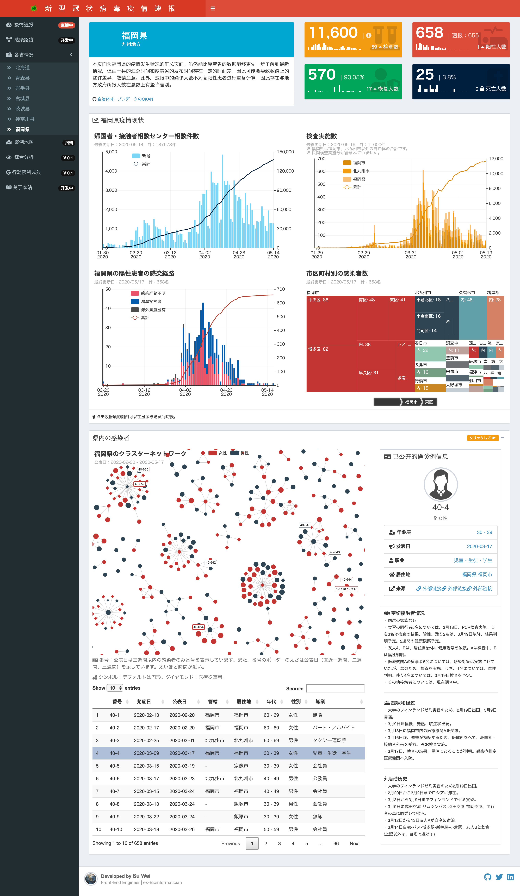

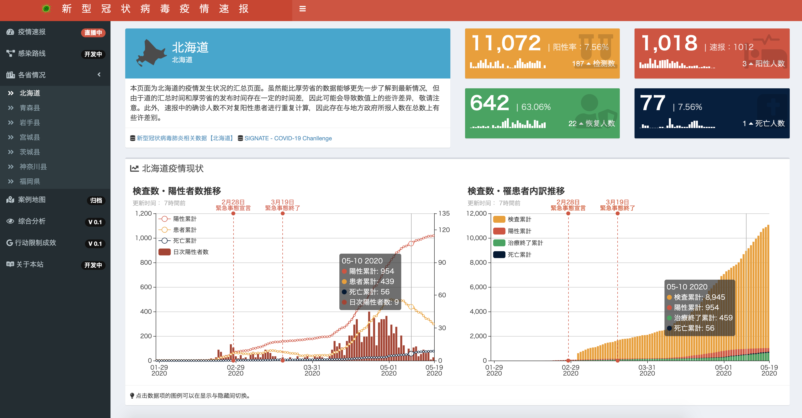

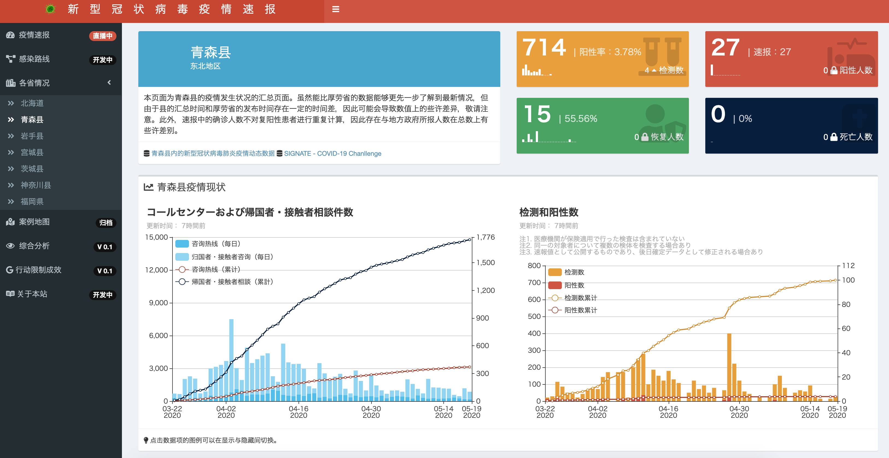

在`案例地图`中可以查看每一个患者的行动轨迹。但由于没有现成数据，不仅需要从各个政府所发布的PDF报告中提取内容写成json文件，还要搜索关于每个病例的新闻报道中的消息（有时候政府的消息非常有限，新闻媒体中常常能够获取到一些额外的信息），工程量实在是太大，因此在项目初期这个开发计划就已经作废了……

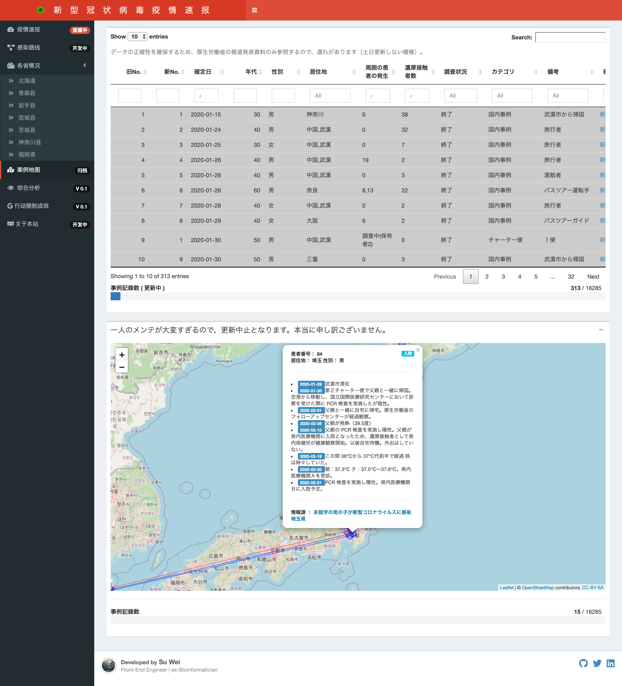

最后是利用谷歌所发布的社区流动报告进行一个简要的可视化。用于了解各地区在国家进行紧急事态宣言后人们的出行情况。完成度较低因此不做详细介绍了。

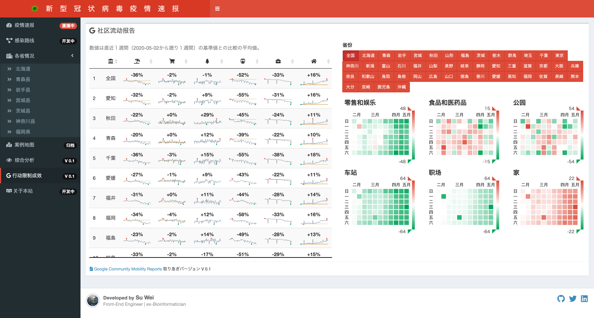

## 结语

感谢大家看了那么长唠唠叨叨的一堆废话，如果能为大家在写shiny应用时提供到一点帮助或者灵感的话那么本文的任务也就达成了一半了。欢迎各位前往项目的Github（https://github.com/swsoyee/2019-ncov-japan） 提Issue或PR。